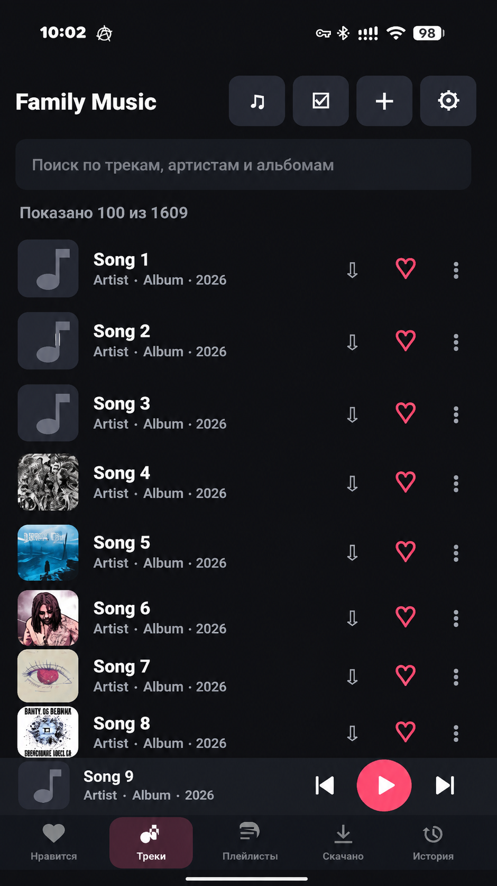

# Family Music Android

## Происхождение проекта

Идея, требования, тестирование и эксплуатация принадлежат **dgl-X**.
Архитектура, весь исходный код, интерфейс и документация текущей версии созданы
с помощью **OpenAI Codex** по запросам владельца и его обратной связи. Подробное
описание участия находится в [`AUTHORS.md`](AUTHORS.md).

Текущая версия: **1.0.31**. Клиент поддерживает выбор собственного HTTPS-сервера на странице входа, потоковое и офлайн-воспроизведение, персональные лайки и плейлисты, загрузку музыки, полноэкранный плеер, Media Session, управляемую очередь, диагностические отчёты и закрытую федеративную библиотеку.

Подтверждённые проблемы и сценарии их воспроизведения ведутся в
[`KNOWN_ISSUES.md`](KNOWN_ISSUES.md).

Нативный Android-клиент Family Music с идентификатором
`org.familymusic.client`. Адрес сервера выбирается пользователем на странице
входа; локальное Gradle-свойство `familyMusicServerOrigin` задаёт только
предзаполненное значение и не хранится в репозитории. По умолчанию используется
`https://music.example.com`. Версии APK именуются строго `f_music_vXX.apk`;
номер `versionCode` увеличивается с каждым билдом.

## Интерфейс



## Проверка исходного кода

```bash
./gradlew --no-daemon testDebugUnitTest assembleDebug
```

Команда запускает локальные unit-тесты и собирает debug APK без release-ключа.
Тот же сценарий автоматически выполняется GitHub Actions при push и pull request.

## v01

- вход существующим семейным аккаунтом;
- сохранение защищённой HTTPS-сессии;
- стартовая коллекция «Мне нравится» и общий каталог;
- добавление и удаление сердечек;
- очередь из текущего списка;
- Media3/ExoPlayer, фоновое воспроизведение, системное уведомление и кнопки гарнитуры;
- поток оригинала через `/api/v1` с авторизованной cookie.

## v02

- более плотный адаптивный layout для телефона;
- обложки в списке и панели текущего трека;
- авторизованная загрузка обложек с memory-cache;
- поиск по трекам, исполнителям и альбомам;
- компактные вкладки, кнопки и состояния пустого поиска;
- улучшенная нижняя панель фонового плеера.

## v03

- корректные отступы от панели уведомлений и системной навигации;
- сердечки закреплены в фиксированной правой колонке;
- mini-player увеличен до 80 dp, кнопки предыдущего/play/следующего имеют фиксированные размеры;
- нажатие на mini-player открывает полноэкранный плеер;
- полноэкранный плеер содержит большую обложку, название, исполнителя, timeline, перемотку и основные кнопки.

## v04

- постоянное скачивание оригиналов во внутреннюю память приложения;
- локальное хранение обложек скачанных треков;
- отдельная вкладка «Скачано» с локальным поиском;
- локальный файл автоматически имеет приоритет при воспроизведении;
- быстрый запуск скачанной медиатеки и воспроизведение без интернета и DNS;
- удаление локальной копии с подтверждением, не затрагивающее общий серверный трек.

## v05

- кнопки скачивания и сердечка объединены в фиксированный правый блок строки;
- полностью прослушанный трек автоматически сохраняется офлайн, если он находится в «Мне нравится»;
- треки без сердечка после прослушивания автоматически не скачиваются;
- ручное скачивание по стрелке остаётся доступным для любого трека.

## v06

- строка трека всегда занимает полную ширину списка, поэтому блок скачивания и сердечка действительно закреплён у правого края независимо от длины названия.

## v07

- Media3 сохраняет получаемый поток в общий временный дисковый кэш прямо во время прослушивания;
- лимит временного кэша — 1 ГБ, старые обычные треки вытесняются по LRU;
- после полного прослушивания понравившийся трек копируется из кэша в постоянное офлайн-хранилище без второго скачивания;
- уже скачанные локальные файлы продолжают воспроизводиться напрямую и не дублируются во временном кэше.

## v08

- список личных плейлистов и создание новых через кнопку в шапке;
- открытие плейлиста с поиском и воспроизведением всего его состава как очереди;
- долгое нажатие на трек открывает добавление в плейлист или удаление из активного;
- долгое нажатие на название активного плейлиста позволяет переименовать или удалить его;
- удаление плейлиста не удаляет музыкальные файлы из общей библиотеки.

## v09

- кнопка `＋` в шапке открывает системный выбор одного или нескольких аудиофайлов;
- загрузка выполняется foreground-service и продолжается при свёрнутом приложении;
- файлы передаются чанками по 1 МиБ с прогрессом в системном уведомлении;
- текущие URI и upload ID сохраняются, после перезапуска отправка продолжается с серверного offset;
- после передачи приложение ожидает серверную обработку и автоматически обновляет библиотеку;
- серверная дедупликация и извлечение тегов/встроенной обложки используются без изменений.

## v10

- долгое нажатие на `＋` показывает до 100 последних загрузок со статусом, прогрессом и ошибкой;
- долгое нажатие на трек открывает единое меню тегов и плейлистов;
- в Android можно изменить название, исполнителя, альбом, жанр и год;
- обновлённые теги синхронизируются с локальной офлайн-копией;
- серверный API истории загрузок доступен только владельцу с активной сессией.

## v11

- отдельная вкладка истории прослушивания с поиском и количеством запусков;
- ручной запуск и автоматический переход Android записываются в серверную историю;
- история воспроизводится как обычная очередь;
- меню долгого нажатия на трек позволяет выбрать обложку из системной галереи или удалить её;
- изображения ограничены 12 МиБ, сервер проверяет и преобразует их, а локальная офлайн-обложка синхронизируется сразу.

## v12

- все четыре вкладки принудительно однострочные и имеют одинаковую высоту;
- полноэкранный плеер открывает текущую очередь;
- трек очереди можно запустить, удалить, поднять или опустить;
- команда «Оставить текущий» очищает остальную очередь;
- долгое нажатие на трек библиотеки содержит «Играть следующим»;
- добавлены shuffle и repeat off/all/one с явным состоянием кнопок.

## v13

- очередь, текущий трек, позиция, shuffle и repeat сохраняются на сервер каждые 10 секунд и после существенных изменений;
- состояние сохраняется при сворачивании и закрытии Activity;
- после полного перезапуска очередь и позиция восстанавливаются, но воспроизведение не запускается самопроизвольно;
- если Media3-сервис продолжает работать, его актуальная очередь имеет приоритет и не перезаписывается старым серверным состоянием.

## v14

- при отключении Bluetooth-магнитолы, наушников или проводного аудиовыхода воспроизведение автоматически ставится на паузу и не переходит на динамик телефона;
- медиасессия загружает защищённую обложку с авторизацией, поэтому она отображается в системном уведомлении и на экране блокировки;
- сессионная cookie передаётся только настроенному серверу, для сторонних адресов авторизация не раскрывается.

## v15

- первые 3 МиБ фактического следующего трека заранее помещаются в общий Media3-кэш;
- предзагрузка пересчитывается при переходе, перестройке очереди, shuffle и repeat;
- при быстром переключении следующий трек начинает играть из кэша, при этом вся очередь заранее не скачивается;
- локальные офлайн-треки не требуют предзагрузки и пропускаются.

## v16

- полноэкранный плеер получил современные векторные кнопки без квадратных текстовых плашек;
- shuffle, previous, крупная круглая play/pause, next и repeat собраны в одну основную панель;
- активные shuffle/repeat выделяются акцентным цветом, repeat one имеет отдельную иконку;
- сердечко размещено справа от названия и исполнителя и позволяет менять «Мне нравится» прямо в плеере;
- состояние лайка синхронизируется с текущей очередью, списком и сервером.

## v17

- основные разделы библиотеки перенесены в нижнюю навигацию под мини-плеером;
- добавлены настройки качества для Wi‑Fi, мобильной сети и офлайн-загрузок: оригинал, авто, AAC 192 и AAC 96;
- добавлено необязательное выравнивание громкости ReplayGain по серверным измерениям без изменения оригиналов;
- добавлен полноэкранный менеджер загрузок и офлайна: прогресс, причины ошибок, пауза, докачка, повтор и управление сохранёнными треками;
- добавлены страницы исполнителей и альбомов с обложкой, длительностью, списком треков, воспроизведением, перемешиванием, лайками и офлайн-действиями;
- автосохранение лайков можно выключить, ограничить Wi‑Fi и выполнять сразу после лайка либо после прослушивания;
- настраиваются лимит Media3-кэша (512 МБ–10 ГБ), объём предзагрузки и стартовый раздел;
- добавлены таймер сна, статистика временного/офлайн-хранилища и раздельная безопасная очистка;
- диагностика показывает версию, адрес сервера и объёмы данных без секретов сессии.

## v18

- очередь и настройки открываются как отдельные полноэкранные разделы Family Music, а не системные окна Android;
- оба экрана получили собственную шапку и явную кнопку возврата;
- очередь показывает текущий трек, исполнителей и количество элементов в прокручиваемом фирменном списке;
- после запуска, удаления или перестановки трека экран очереди обновляется на месте;
- короткие опасные действия по-прежнему подтверждаются отдельным системным диалогом.

## v19

- нижняя навигация содержит пять разделов с векторными иконками: «Нравится», «Треки», «Плейлисты», «Скачано», «История»;
- активная вкладка выделяется акцентной подложкой, остальные остаются визуально спокойными;
- настройки разделены на «Звук и качество», «Кэш и загрузки», «Интерфейс и воспроизведение» и «Аккаунт»;
- логические параметры получили настоящие переключатели с пояснениями;
- выбор качества, размера кэша, предзагрузки, стартового раздела и таймера теперь открывается в фирменных полноэкранных меню;
- системные диалоги используются только для подтверждения очистки, удаления и выхода.

## v20

- «Плейлисты» открываются отдельным полноэкранным разделом с обложками, количеством треков и суммарной длительностью;
- создание, переименование и меню действий плейлиста переведены в фирменные экраны;
- у каждой карточки есть явная кнопка действий, управление больше не зависит от долгого нажатия;
- открытый плейлист показывает своё название в шапке и кнопку возврата к списку плейлистов;
- настройки показывают оставшееся время таймера сна, таймер переживает пересоздание playback-service;
- полноэкранный плеер отображает фактический вариант ответа сервера: оригинал, AAC 192, AAC 96 либо офлайн-копию.

## v21

- в каждой строке трека появилась статичная кнопка `⋮`, долгое нажатие больше не требуется;
- действия «играть следующим», плейлисты, теги, обложка и удаление собраны в фирменном полноэкранном меню;
- выбор плейлиста и управление обложкой также переведены в полноэкранные экраны;
- редактор названия, исполнителя, альбома, жанра и года стал отдельным экраном с корректной проверкой до закрытия;
- добавлено подтверждаемое удаление трека из общей библиотеки;
- сервер при удалении очищает оригинал, обложку и все созданные AAC-производные.

## v22

- кнопка в шапке и долгое нажатие на строку включают множественный выбор;
- выбранные треки можно одним действием добавить в личный плейлист или скачать для офлайна;
- групповое удаление показывает точное число треков и требует отдельного подтверждения;
- панель показывает счётчик, а обычные кнопки трека на время выбора скрываются.

## Stable v1.0

- функциональность протестированных версий v01–v22 зафиксирована как первый стабильный релиз;
- `versionCode=100`, `versionName=1.0.0`;
- APK подписывается постоянным RSA-4096 release-ключом, а не Android debug-ключом;
- экран входа полностью обновлён: фирменный фон, карточка формы, удобная клавиатурная навигация, проверка пустых полей и понятное состояние авторизации;
- большие каталоги подгружаются страницами по 100 строк и не создают тысячи Android View одновременно;
- запуск трека строит отдельную очередь всего текущего раздела, а shuffle запрашивает случайный порядок по всей серверной библиотеке (до 10 000 треков);
- сохранение и восстановление очереди расширено до 10 000 элементов;
- создание ключа, резервная копия и процедура сборки описаны в [`RELEASE.md`](RELEASE.md).

## v1.0.6

- длительность MP3 без Xing/VBR-заголовка берётся из серверных метаданных, поэтому шкала времени и перемотка доступны сразу;
- constant-bitrate seeking остаётся включённым для корректной перемотки таких файлов;
- предзагрузка запускается только после фактического перехода, смены shuffle/repeat и отменяет предыдущую задачу при быстром листании;
- User-Agent содержит номер версии приложения, чтобы установленную сборку можно было проверить по журналу сервера.

## v1.0.7

- внизу настроек добавлено действие «Сообщить об ошибке»;
- отчёт содержит введённое описание, состояние Media3, текущий трек, очередь, тип сети, размеры локальных хранилищ и последние 120 событий;
- пароль, cookie, токены, идентификаторы устройства и музыкальные файлы в отчёт не включаются;
- отчёты просматриваются администратором через WEB-кнопку «Ошибки».

## v1.0.8

- экран очереди показывает её источник и количество треков;
- источник сохраняется на сервере вместе с позицией и восстанавливается после перезапуска;
- в очереди доступна явная команда «Перемешать все треки», которая строит глобальную очередь всей библиотеки независимо от открытого раздела.

## v1.0.9

- шкала полноэкранного плеера отдельно показывает воспроизведённую и уже загруженную части без лишней процентной подписи;
- Media3 держит адаптивный рабочий буфер от 15 до 90 секунд и 30 секунд уже прослушанного звука;
- подготовка следующего трека начинается с небольшой задержкой, чтобы не конкурировать с быстрым стартом текущего;
- быстрое переключение немедленно отменяет старую задачу предзагрузки и планирует только актуальную.

## v1.0.10

- удалено принудительное Media3 clipping-ограничение, которое могло пересоздать timeline и вернуть текущий MP3 в начало;
- серверная длительность остаётся запасным значением только для шкалы интерфейса, constant-bitrate seeking сохранён;
- диагностический отчёт всегда содержит ID, название и исполнителя из MediaSession, даже после пересоздания Activity;
- журнал фиксирует скачки позиции и изменения repeat/shuffle, чтобы отличать автоматический переход, seek, skip и внутренний сброс;
- числовая подпись процента буфера убрана, загруженная часть по-прежнему видна второй полосой.

## v1.0.11

- адрес Family Music вводится прямо на странице входа и сохраняется на устройстве;
- если схема не указана, автоматически используется HTTPS; пути, параметры и небезопасный HTTP отклоняются;
- при смене сервера старая сессия не отправляется новому узлу;
- production-адрес больше не зашит в исходный код или APK-сборочную конфигурацию;
- Android namespace и application ID переведены на нейтральный `org.familymusic.client`.

## v1.0.12

- в настройках появился полноэкранный раздел «Устройства»;
- видны собственные активные входы, клиент, IP и время последней активности;
- текущая сессия отмечена отдельно, токены и cookie никогда не отображаются;
- отдельную сессию можно завершить, также доступно завершение всех остальных входов;
- Android сообщает серверу модель устройства и версию клиента при входе.

## v1.0.16

- внутренний сброс Media3 внутри того же трека больше не возвращает воспроизведение в начало: клиент восстанавливает последнюю позицию;
- оборванный сетевой поток повторно открывается с сохранением позиции до трёх раз, после чего приложение безопасно переходит дальше;
- диагностический журнал фиксирует появление, потерю и смену Wi-Fi, мобильной сети и VPN.

## v1.0.17

- список исполнителей использует собственные изображения локальных карточек;
- страница исполнителя показывает описание, количество альбомов, feat-участий и общих прослушиваний;
- связанные альбомы открываются непосредственно со страницы исполнителя.

## v1.0.20

- «Все треки» получает объединённую локальную и федеративную библиотеку через домашний сервер;
- «Мне нравится» показывает единый личный список без отдельного фильтра источника;
- удалённые треки сохраняют opaque reference в очереди и воспроизводятся через защищённый прокси домашней ноды;
- сердечко удалённого трека запускает фоновый импорт оригинала, после которого он появляется как независимый локальный трек;
- недоступные remote-треки обозначаются в списке и не ломают запуск очереди;
- добавление локальных и удалённых треков в плейлисты использует соответствующие API, а редактирование и общее удаление для remote-карточек скрыты.

## v1.0.21

- отложенное восстановление сетевого потока привязано к конкретному треку и
  отменяется при ручном или автоматическом переходе;
- retry больше не включает воспроизведение вопреки нажатой пользователем паузе;
- предзагрузка следующего трека отменяется на время восстановления основного
  потока и запускается заново только после состояния `READY`;
- после трёх неудачных повторов недоступный трек пропускается с сохранением
  выбранного состояния play/pause;
- одинаковые сообщения о сетевой ошибке не выводятся на каждую попытку.

## v1.0.22

- страницы большого каталога больше не показывают повторный трек на каждой
  границе из 100 позиций;
- адаптер дополнительно отбрасывает повторяющиеся ID при догрузке страницы;
- клиент проверен на библиотеке и shuffle-очереди из 10 000 треков.

## v1.0.23

- глобальный shuffle больше не перемешивает одну очередь дважды;
- Media3 хранит единственный порядок shuffle, поэтому «Назад» возвращает
  действительно предыдущий воспроизведённый трек.

## v1.0.24

- Media3 держит до трёх минут текущего потока в буфере и сохраняет полученное во временный кэш;
- заранее загружаются начальные части двух следующих треков в порядке очереди, включая shuffle;
- на неметрируемой сети текущий трек догружается полностью, если известен размер и он не превышает 64 МиБ;
- предзагрузка прекращается на паузе, её объём на каждый следующий трек выбирается в настройках.

## v1.0.25

- при source-ошибке Media3 удаляется только временный кэш текущего трека, поэтому retry делает чистый Range-запрос вместо повторного чтения повреждённого участка;
- диагностический отчёт содержит цепочку исключений источника для точного разбора сетевых и кэш-ошибок.

## v1.0.26

- альбом открывается по стабильному `album_id`, поэтому одноимённые релизы разных исполнителей не смешиваются;
- карточка альбома показывает отдельную обложку, описание, исполнителя и год;
- запрос сохраняет текстовые `artist` и `album` как fallback для серверов без поддержки карточек альбомов.

## v1.0.27

- «Мне нравится» оформлено как самостоятельная коллекция с количеством треков и быстрыми действиями «Слушать»/«Перемешать»;
- верхняя панель стала легче, строки треков — компактнее, а мини-плеер получил вид плавающей карточки;
- полноэкранный плеер использует крупную обложку, мягкий градиентный фон и более спокойную иерархию управления.

## v1.0.28

- офлайн-каталог больше не разбирается, не проверяется и не сортируется на главном UI-потоке при запуске;
- после успешной проверки сессии экран переключается с офлайн-режима на серверную библиотеку без повторного создания Activity и переподключения плеера;
- наличие локальной музыки определяется без полного обхода всех сохранённых треков.

## v1.0.29

- индекс потокового кэша Media3 прогревается в фоновом потоке, поэтому его открытие больше не останавливает первый кадр приложения;
- подключение MediaController начинается после прогрева кэша, а длительность обоих этапов записывается в диагностический журнал;
- устаревший результат параллельного подключения плеера больше не может заменить актуальный контроллер.

## v1.0.30

- временная сетевая ошибка при запуске больше не удаляет локальную сессию; повторный вход требуется только после HTTP 401;
- выбранная песня запускается сразу из уже загруженного списка, а остальная очередь добавляется фоном;
- ответ старого запроса очереди не может изменить более новый выбор пользователя.

## v1.0.31

- переключение на трек, уже находящийся в очереди Media3, выполняется через `seekTo` без остановки и пересоздания плеера;
- новый трек из той же коллекции вставляется следующим и запускается без потери существующей очереди;
- переход в другую коллекцию, альбом или плейлист по-прежнему создаёт очередь из нового контекста;
- одиночное нажатие больше не запрашивает и не добавляет в UI-поток до 10 000 треков;
- надпись «Готовим очередь…» убрана из сценария выбора песни.

## Сборка

Нужны JDK 17+ и Android SDK Platform/Build Tools 36.

```bash
cd /path/to/family-music/android
ANDROID_HOME=/path/to/android-sdk \
FAMILY_MUSIC_SIGNING_PROPERTIES=/private/path/signing.properties \
./gradlew clean assembleRelease
cp app/build/outputs/apk/release/app-release.apk ../builds/f_music_v1.0.31.apk
```

Стабильные версии подписываются постоянным ключом и устанавливаются обновлением друг поверх друга. Процедура выпуска описана в [`RELEASE.md`](RELEASE.md).

## Лицензия

Android-клиент распространяется на условиях **GNU General Public License v3.0
only** (`GPL-3.0-only`). При распространении изменённого клиента необходимо
сохранить эту лицензию и предоставить соответствующий исходный код. Полные
условия находятся в файле [`LICENSE`](LICENSE).
